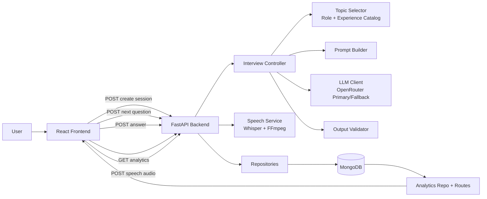
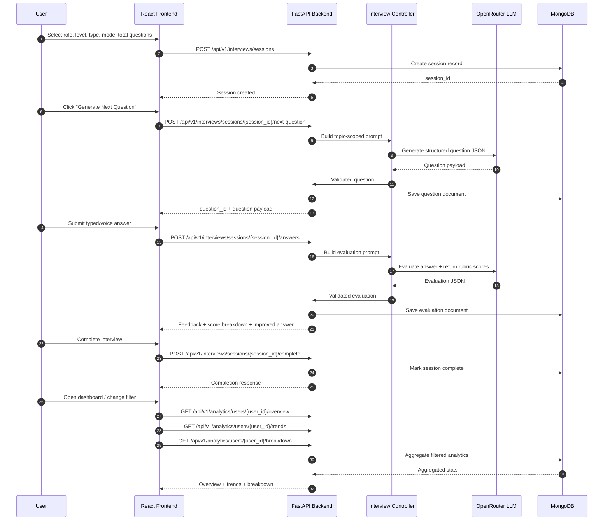

# Project Working and Architecture

This document explains how the GenAI Interview Trainer works internally, from user action to AI output, storage, and analytics.

## 1. High-Level Flow

1. User configures interview settings in the frontend.
2. Frontend creates a session via backend API.
3. Backend uses role/experience topic catalogs and prompt templates to generate a structured question through OpenRouter.
4. User submits text or voice answer.
5. Backend evaluates answer using LLM prompts with strict JSON validation.
6. Backend stores session, question, and evaluation in MongoDB.
7. Dashboard APIs aggregate stored evaluations and return overview, trends, and metric breakdowns.
8. Frontend renders score cards, charts, and data-driven insights.

## 2. Architecture Diagram

## 2.1 Sequence Diagram (Request-by-Request Flow)

## 3. Backend Working (Detailed)

## 3.1 Session and Interview Lifecycle

- Route: create session
  - Input includes user_id, role, experience_level, question_type, mode, total_questions.
  - Session is persisted in MongoDB with metadata and counters.

- Route: next question
  - Backend identifies the current step and allowed topic scope.
  - Topic Selector picks a relevant topic from catalogs under backend/app/topics/catalog.
  - Prompt Builder composes a strict instruction for JSON output.
  - LLM Client calls OpenRouter with fallback behavior if primary model fails.
  - Output Validator checks required fields, schema shape, and bounded score/format rules.
  - Valid question is stored and returned.

- Route: submit answer
  - User answer is evaluated by AI prompt templates.
  - Returned evaluation is validated to ensure stable structure:
    - accuracy, clarity, structure, completeness, overall
    - strengths, improvements, feedback, improved_answer
  - Evaluation is persisted and linked to question + session.

- Route: complete session
  - Session status is updated and final counters/summaries are saved.

## 3.2 Speech Pipeline

- Route: speech transcription
  - Frontend uploads recorded audio.
  - Backend Speech Service loads Whisper runtime.
  - FFmpeg is used by Whisper for audio decoding support.
  - Transcribed text is returned and can be edited before answer submission.

## 3.3 Analytics Pipeline

Analytics endpoints read stored evaluations and aggregate by user and optional question type filter.

- Overview:
  - sessions_count
  - average_score
  - latest_score

- Trends:
  - time-series score points for charting

- Breakdown:
  - average accuracy, clarity, structure, completeness

These APIs are consumed by the dashboard page and update when filter selection changes.

## 3.4 Semi-RAG Topic Control (Detailed)

The project uses a semi-RAG approach for question generation. It is called semi-RAG because it performs retrieval, but from curated internal catalogs instead of a full external vector database.

How it works:

1. The system receives role, experience level, and question type from the active session.
2. Topic Selector reads the role-specific catalog from backend/app/topics/catalog.
3. It excludes recently used topics in the same session to reduce repetition.
4. It chooses a topic that matches role + level constraints.
5. Prompt Builder injects that topic into a strict generation prompt.
6. LLM produces a structured question payload tied to that retrieved topic.

Why this is useful:

- Keeps the interview grounded in domain-relevant content.
- Prevents random, generic, or off-role questions.
- Improves consistency across sessions.
- Reduces hallucination risk by constraining generation context before model invocation.

Current scope of retrieval:

- Retrieval source: static JSON catalogs.
- Retrieval granularity: role-level and experience-level topics.
- Retrieval strategy: deterministic/controlled selection with anti-repetition rules.
- Generation strategy: retrieved topic + strict prompt + response validation.

This gives many of the practical benefits of RAG for this use case while keeping implementation lightweight and easy to maintain.

## 3.5 Semi-RAG vs Plain API Call to LLM

A plain API call means sending a generic prompt directly to the model with little or no retrieved context. Semi-RAG adds a retrieval layer before the model call.

Comparison:

- Plain API call:
  - Input: user request + generic instruction.
  - No controlled retrieval.
  - Output quality depends heavily on model prior knowledge and prompt wording.
  - Higher chance of generic or irrelevant interview questions.

- Semi-RAG in this project:
  - Input: user request + retrieved role/topic context + strict schema prompt.
  - Controlled retrieval from curated catalogs.
  - Output is domain-scoped and validated against expected schema.
  - Lower chance of irrelevant questions and malformed outputs.

In short, this architecture is not just “call LLM and return text.” It is an orchestration pipeline:

retrieval -> prompt construction -> LLM generation -> validation -> persistence -> analytics.

That orchestration is the key difference that makes outputs more reliable for interview training.

## 4. Frontend Working (Detailed)

## 4.1 Interview Page

- Interview setup form sends session creation request.
- Question panel displays generated question and topic.
- Answer input supports:
  - direct typing
  - voice recording and transcription
- Feedback card displays score breakdown, strengths, improvements, and improved answer.

## 4.2 Dashboard Page

- Calls overview/trends/breakdown endpoints in parallel.
- Applies selected question type filter to all analytics requests.
- Renders:
  - stat cards (sessions, average, latest, readiness)
  - trend chart
  - per-metric progress bars
  - dynamic strengths/weaknesses/suggestions from filtered data

## 5. Data Contracts

## 5.1 Session Request

- user_id
- role
- experience_level
- question_type
- mode
- total_questions

## 5.2 Question Payload

- question
- topic
- question_type
- expected_answer_points
- evaluation_rubric

## 5.3 Evaluation Payload

- scores:
  - accuracy
  - clarity
  - structure
  - completeness
  - overall
- strengths
- improvements
- feedback
- improved_answer

## 6. Reliability and Guardrails

- Primary/fallback model strategy for OpenRouter requests.
- Retry and error handling around transient upstream failures.
- Strict validator to avoid malformed AI output reaching UI.
- Backend-side filtering for analytics to keep frontend consistent.
- Clear speech dependency errors when FFmpeg/runtime is unavailable.

## 7. Runtime Components

For local development, run these components:

1. MongoDB
2. FastAPI backend on port 8000
3. Vite frontend on port 5173

## 8. Suggested Improvements

1. Add background job queue for expensive LLM/speech tasks.
2. Add user authentication and per-user data isolation.
3. Add caching layer for analytics endpoints.
4. Add integration tests for full interview workflow.
5. Add model usage telemetry and cost dashboards.

## 9. GitHub, Secrets, and Environment Files

- Keep real secrets only in local environment files.
- Track only sample templates (`.env.example`) in git.
- Ensure `.env` files are ignored by `.gitignore`.
- On clone, copy templates and populate values locally:
  - `backend/.env.example` -> `backend/.env`
  - `frontend/.env.example` -> `frontend/.env`
- If any secret is exposed in a commit, rotate the credential immediately.
- Prefer CI/CD encrypted secrets or managed secret stores for production.
